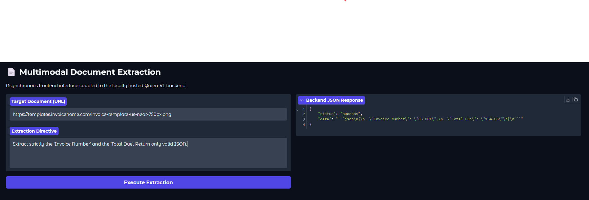

# Asynchronous VLM Document Extraction API

## Overview
This repository contains a prototype for a asynchronous document extraction pipeline. It bypasses traditional, fragile OCR systems by utilizing a 4-bit quantized Vision-Language Model (Qwen-VL) to perform layout-aware data extraction, outputting strictly typed JSON.

## Architecture & System Design
The system is designed with strict hardware constraints in mind, specifically targeting deployment on 16GB NVIDIA Tesla T4 GPUs.

* **Inference Engine:** Utilizes `transformers` and `bitsandbytes` to load a 2-billion parameter multimodal model.
* **Quantization Strategy:** Implements 4-bit NormalFloat4 (NF4) quantization with double quantization enabled. This drastically reduces the VRAM footprint, preventing Out-Of-Memory (OOM) exceptions and reserving memory for the KV cache.
* **Asynchronous Serving:** The inference engine is wrapped in a FastAPI REST endpoint utilizing `asyncio`. This decouples the GPU compute from the web server, allowing for graceful handling of concurrent requests.
* **Data Validation:** Enforces strict Pydantic schemas on incoming payloads to protect the GPU from processing malformed data.
* **Decoupled UI:** Includes a standalone Gradio frontend to simulate microservice communication with the AI backend.

## Hardware Requirements for Deployment
To run this Dockerized container in a production environment:
* **GPU:** 1x NVIDIA Tesla T4 (or equivalent with >= 12GB VRAM).
* **Runtime:** NVIDIA Container Toolkit must be installed on the host machine to pass GPU access to the Docker container.

## Run Command
```bash
docker run --gpus all -p 8000:8000 -d vlm-extraction-api


